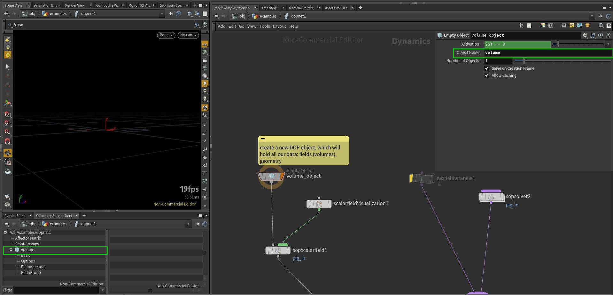
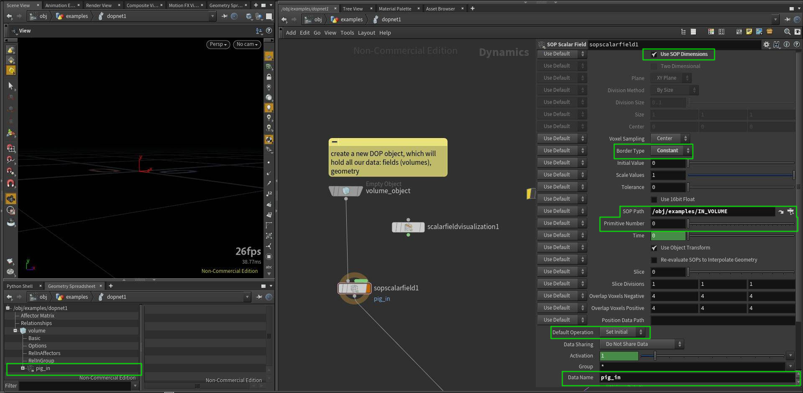
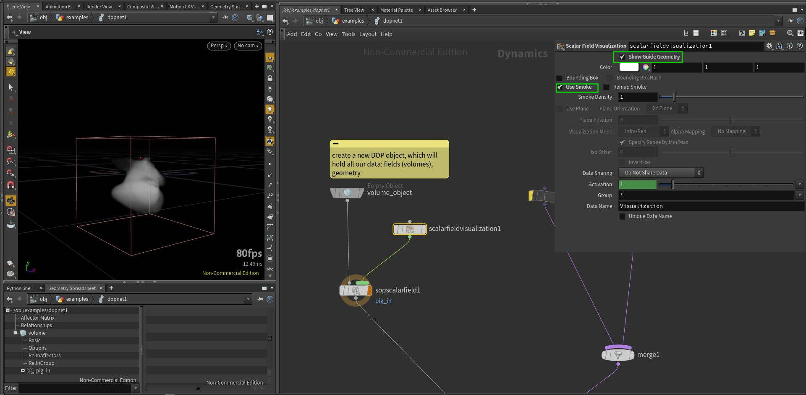
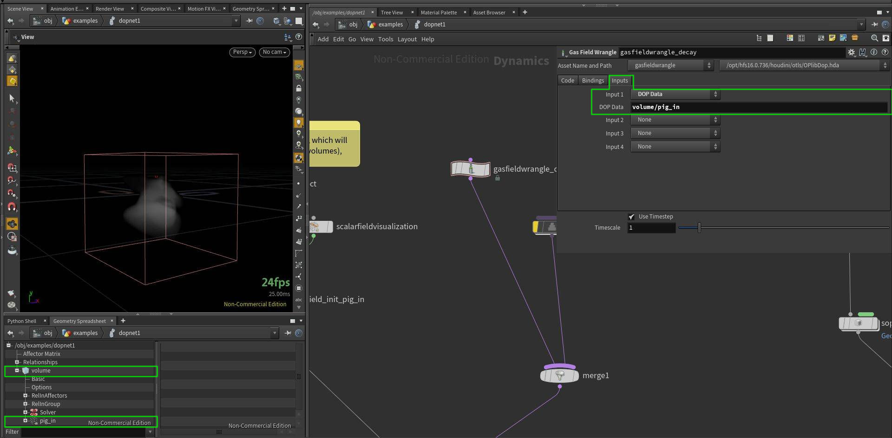
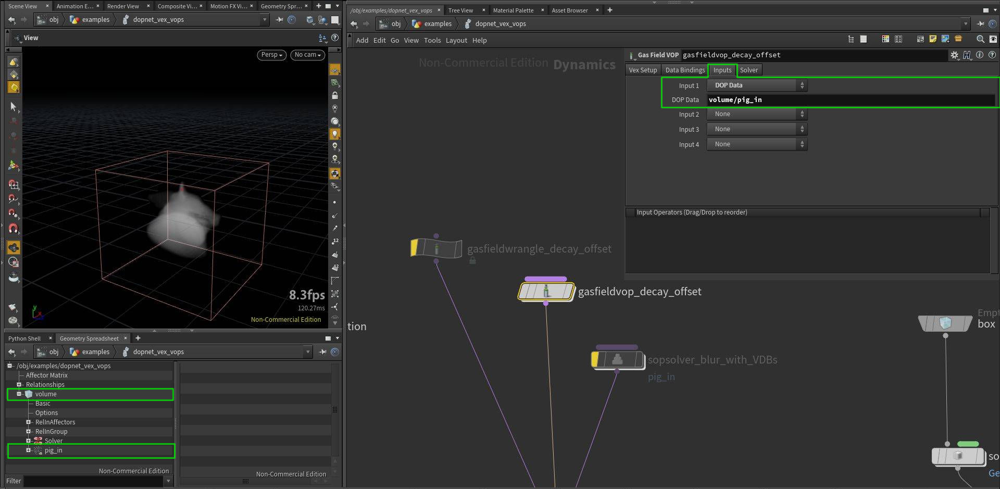
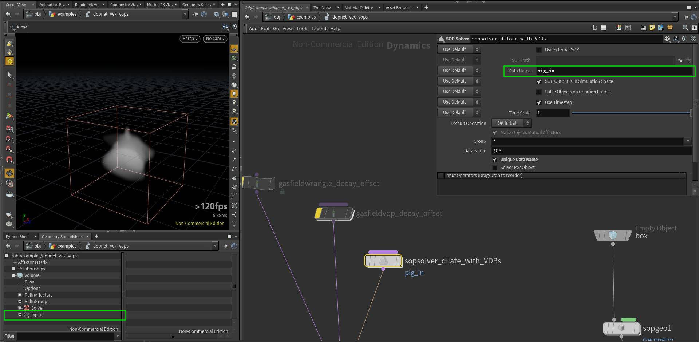
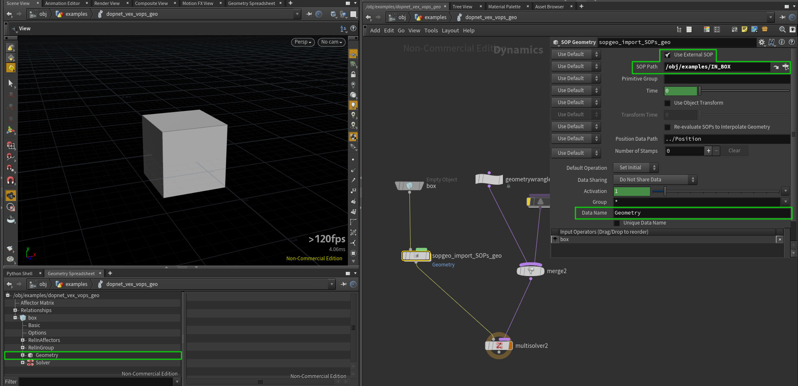
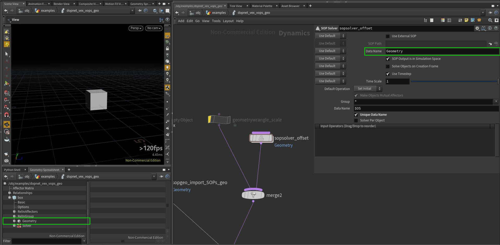

# VEX tutorial
## A collection of code snippets and examples showing syntax and capabilities of VEX language inside SideFX Houdini
<p align="right"><small><sup>by Juraj Tomori</sup></small></p>

<br>

### Intro
Recently I made a small lecture for other students at Filmakademie. They requested an introduction lecture to using VEX. I did not focus on practical examples and fancy operations, but on syntax, capabalities and usage. During the lecture I got some ideas on extending the content. So I looked more into the topics and collected them along with explanations inside one hip file. This tutorial belongs to series of my posts at my [blog](https://jurajtomori.wordpress.com/). However because of the formatting and other limitations of Wordpress I decided to place it here. It will also be easier to keep track of changes.

<br>

### How to use it
You can clone, or [directly download](https://github.com/jtomori/vex_tutorial/archive/master.zip) this repository.<br>
It contains **examples.hipnc** and [**vex/include/myLib.h**](./vex/include/myLib.h) files which are full of various examples with explanations in comments.<br>
It is the best to check all the nodes with open *Geometry Spreadsheet* and *Console Output* windows to see values of attributes and output text. Alternatively you can use this page for quick looking at the topics covered and most of the code that I include here as well. I am not including here all of the code since sometimes it might not make a lot of sense outside of Houdini. Where necessary I include related functions from *myLib.h* or attach screenshots.


<br>

### Topics
* [Reading parameter values](#reading-parameter-values)
* [Reading attributes](#reading-attributes)
* [Exporting attributes](#exporting-attributes)
* [Reading arrays](#reading-arrays)
* [Arrays](#arrays)
* [Arrays and strings example](#arrays-and-strings-example)
* [Checking for attributes](#checking-for-attributes)
* [Automatic attribute creation](#automatic-attribute-creation)
* [Getting transformation from OBJs](#getting-transformation-from-objs)
* [Intrinsics](#intrinsics)
* [VDB intrinsics](#vdb-intrinsics)
* [Volumes](#volumes)
* [VOPs / Using Snippets](#vops--using-snippets)
* [VOPs / Using Inline Code](#vops--using-inline-code)
* [DOPs / Volumes workflow](#dops--volumes-workflow)
* [DOPs / Gas Field Wrangle](#dops--gas-field-wrangle)
* [DOPs / Geometry workflow](#dops--geometry-workflow)
* [DOPs / Geometry Wrangle](#dops--geometry-wrangle)
* [Printing and formatting](#printing-and-formatting)
* [Printing attributes](#printing-attributes)
* [Including external VEX files](#including-external-vex-files)
* [Include math.h](#include-mathh)
* [Using macros](#using-macros)
* [Functions](#functions)
* [Functions overloading](#functions-overloading)
* [Variables casting](#variables-casting)
* [Vectors swizzling](#vectors-swizzling)
* [Functions casting](#functions-casting)
* [Structs](#structs)
* [Structs in Attribute Wrangle](#structs-in-attribute-wrangle)


<br>

### Tutorial

#### Reading parameter values
```C
/*
multi-line comments can be typed
using this syntax
*/

// in vex you can evaluate values from parameters on this node
// by calling ch*() function, with * representing a signature, check the docs
// for the full list, some of them: chv() - vector, chu() - vector2, chs() - string
// chramp() - ramp, chp() - vector4, chi() - int, chf() - float, ch4() - matrix, ch3() - matrix3 ...
// you can also use optioinal parameter for time which will enable you to evaluate
// the channel at different frame
//
// once you type ch*() in your code, you can press a button on the right, to
// generate a UI parameter for it automatically, you can do the same by hand as well
float y = chf("y_position");
vector col = chv("color");
matrix3 xform = ch3("xform");

// you can also reference parameters in external nodes
// if there is an expression (Python/hscript) in the parameter,
// it will be evaluated
float up = chf("../params_1/move_up");


// apply variables to attributes
v@P.y += y*5;
v@Cd = col;
v@P *= xform;
v@P.y += up;

v@myVec = 1.456;
v@myVec += v@N.y;
```
<br>

#### Reading attributes
```C
float blend = chf("blend");
float blendPig = chf("blend_pig");
vector P1, P2, P3, P_new;

// this is one way of reading attributes, this is only valid, when
// point count is exactly the same in both inputs, attribute from second
// input with the same @ptnum is retrieved
// v@P can also be replaced with @P, since it can be guessed as it is commonly
// used attribute, I prefer explicit declaration :)
// v@ - vector, i@ - integer, f@ - float, 3@ - matrix3, p@ - vector4
// 4@ - matrix4, 2@ - matrix2, u@ - vector2, s@ - string,
//P1 = v@P;
//P2 = v@opinput1_P; // inputs numbering starts at 0, therefore 1 refers to the second input

// this approach is useful for querying attributes from different point (other from the currently processed one)
// node inputs start as well from 0 (first input), 1 (second input) ...
P1 = point(0, "P", @ptnum);
P2 = point(1, "P", @ptnum);

// note that you can also read attributes from node, which is not connected
// to the current node, use the "op:" syntax
// this is valid for any function which is expecting geo handle (sampling from other volumes...)
// Houdini network UI will not detect this dependency when Show -> Dependency links display is enabled
P3 = point("op:../pig_shape", "P", @ptnum);


// blend positions
P_new = lerp(P1, P2, blend);
P_new = lerp(P_new, P3, blendPig);

v@P = P_new;
```
<br>

#### Exporting attributes
```C
// create a new attribute simply by typing *@attrib_name with
// * representing its signature
// v@ - vector, i@ - integer, f@ - float, 3@ - matrix3, p@ - vector4
// 4@ - matrix4, 2@ - matrix2, u@ - vector2, s@ - string,

v@myVector = {1,2,3};
// vectors with functions/variables in them need to be created with set()
u@myVectorFunc = set(@Frame, v@P.y);
u@myVector2 = {4,5};
f@myFloat = 400.0;
i@myInteger = 727;
3@myMatrix3x3 = matrix3( ident() ); // function casting, will be explained in other node
4@myMatrix4x4 = matrix( ident() );
s@myString = "abc";


// attributes can be set to different point from the currently processed one
// and if they do not exist, they need to be added first
// setpointattrib() is also the only way of setting an attribute on newly
// created points
addpointattrib(0, "Cd", {0,0,0});
setpointattrib(0, "Cd", 559, {1,0,0});

// arrays can be exported as well
v[]@myVectorArray = { {1,2,3}, {4,5,6}, {7,8,9} };
u[]@myVector2Array = { {4,5}, {6,7} };
f[]@myFloatArray = { 4.0, 2.7, 1.3};
i[]@myIntegerArray = {132, 456, 789};
// arrays containing functions/variables need to be initialized with array() function
3[]@myMatrix3x3Array = array( matrix3( ident() ), matrix3( ident() ) * 5 ); // refer to functions_casting node for the meaning of matrix3()
4[]@myMatrix4x4Array = array( matrix( ident() ), matrix( ident() ) * 9 );
s[]@myStringArray = { "abc", "def", "efg" };
```
<br>

#### Reading arrays
```C
// this is how you can create local array variables and load array attributes
vector myVectorArray [] = v[]@myVectorArray;
// ...
// you get the idea

matrix3 a = ident() * 5;

v@P.x *= a.yy; // you can access matrix components using this syntax
// x -> 1, y -> 2, z -> 3, w -> 4
v@P.y = 4[]@myMatrix4x4Array[1].ww;
v@P.z = u[]@myVector2Array[1][0]; // this is how you can access array of vectors
```
<br>

#### Arrays
```C
int numbers[] = array(1,2,3,4);

// arrays can be handled in Pythonic way
numbers = numbers[::-1];

// rading from arrays
i@firstItem = numbers[0];
// writing into arrays
numbers[0] += 1;
// indexing can also go backwards
i@secondLastItem = numbers[-2];

// slicing
i[]@firstHalf = numbers[:2];
i[]@secondHalf = numbers[2:];

// some useful functions
i@returnedPopVal = pop(numbers); // removes the last element and returns it
push(numbers, i@returnedPopVal); // appends element to the array
i@lenghtOfArray = len(numbers);

// export into integer array attribute
i[]@numbers = numbers;

// flattening an array of vectors and reverting it
vector vectors[] = { {1,2,3}, {4,5,6}, {7,8,9} };
f[]@serializedVectors = serialize(vectors);
v[]@unserializedFloats = unserialize(f[]@serializedVectors);
```
<br>

#### Arrays and strings example
```C
// simple example of manipulating strings and arrays
// it will convert /path/to/the/project/file/project_v3.hipnc
// into            /path/to/the/project/file/preview/project_v3_img_0001.jpg
// with 0001 being current frame number

string path = chs("path"); // get string from path parameter of the current hipfile
s@pathOrig = path; // store into attribute original value

string pathSplit[] = split(path, "/"); // split path into array of strings based on "/" character

string fileName = pop(pathSplit); // remove last value of the array and assign it into a variable
string fileNameSplit[] = split(fileName, "."); // split string into an array based on "." character
fileNameSplit[0] = fileNameSplit[0] + sprintf("_img_%04d", @Frame); // append into the string _img_0001 (current frame number)
fileNameSplit[-1] = "jpg"; // change file extension
fileName = join(fileNameSplit, "."); // convert array of strings into a one string with "." between original array elements
push(pathSplit, "preview"); // append "preview" string into the array of strings
push(pathSplit, fileName); // append file name into the array of strings

path = "/" + join(pathSplit, "/"); // convert array of strings into one string, starting with "/" for root, because it is not added before the first element, only to in-betweens

s@path = path; // output into the attribute
```
<br>

#### Checking for attributes
```C
// it is possible to determine if incoming geometry has an attribute

i@hasCd = hasattrib(0, "point", "Cd");
i@hasN = hasattrib(0, "point", "N");
i@hasOrient = hasattrib(0, "point", "orient");
i@hasPscale = hasattrib(0, "point", "pscale");
```
<br>

#### Automatic attribute creation
```C
// if you use @attribute and it does not exist, 
// then it will be automatically created
// this might lead to problems, when you have a typo and a 
// new attribute is created

f@foo = 4;
f@boo = v@Cd.y;
//v@CD = {1,1,0}; // this line does not work here, otherwise it would crete new v@CD attribute

// if you remove * chracter from "Attributes to Create" parameter
// bellow, then you need to manually specify new attributes
// to be created, if you then have a typo and use v@CD instead
// of v@Cd, node will report an error
```
<br>

#### Getting transformation from OBJs
```C
// VEX is well integrated into Houdini, it can for example fetch
// world space transformation matrix from an OBJ node, let it be a null
// or part from a rig, camera or whatever object there which has a transformation
// optransform() will contain also all parent transformations

string nodePath = chs("node_path"); // parameter is a string, but I went into "Edit Parameter Interface" and specified it to be a Node Path
matrix xform = optransform(nodePath);

v@P *= invert(xform);
```
<br>

#### Intrinsics
```C
// a lot of information and functionality is stored in
// "intrinsic" attributes, they might be hidden to many users
// because they do not show up in primitive attributes list
// by default
// they are however very useful and important for manipulating
// and controlling those primitives from VEX

// you can display intrinsics in Geometry Spreadsheet, in primitive attributes
// and Show All Intrinsics in Intrinsics drop-down menu
// intrinsics that are greyed out are read-only, the rest is also writable

// in this example I will show you how to access and modify those
// values, I will refer to them based on their point numbers as
// those intrinsics vary based on the primitive we are dealing with
// 0 - packed geo, 1 - VDB, 2 - sphere, 3 - packed disk, 4 - abc
// if you change order of inputs in merge, then those numbers will change
// in our case @ptnum matches @primnum

// this is the type of our primitive
s@primitiveType = primintrinsic(0, "typename", @ptnum);

matrix3 xform = ident();

// sphere
if (@ptnum == 2) {
    // accessing sphere volume and area
    f@sphereVolume = primintrinsic(0, "measuredvolume", @ptnum);
    f@sphereArea = primintrinsic(0, "measuredarea", @ptnum);
    
    // changing sphere scale, rotation which is not accessible through standard attributes
    // this intrinsic is also present on other primitives
    xform = primintrinsic(0, "transform", @ptnum);
    scale(xform, {1,2,3});
    rotate(xform, radians(45), normalize({1,2,3}) );
}

// packed geo
if (@ptnum == 0) {
    // change viewport display to point cloud
    setprimintrinsic(0, "viewportlod", @ptnum, "points", "set");
    
    // move packed's pivot to the bottom
    // bounds are stared in this order: xmin, xmax, ymin, ymax, zmin, zmax
    float bounds[] = primintrinsic(0, "bounds", @ptnum);
    vector pivot = primintrinsic(0, "pivot", @ptnum);
    pivot.y = bounds[2];
    setprimintrinsic(0, "pivot", @ptnum, pivot, "set");
    v@P.y = bounds[2];
    
    // and now transform the primitive along its new pivot :)
    xform = primintrinsic(0, "transform", @ptnum);
    scale(xform, {1,2,3});
    rotate(xform, radians(-45), normalize({1,2,3}) );
}

// packed disk
if (@ptnum == 3) {
    // changing this intrinsic can point the primitive into different geometry on disk
    // so instead of boring cube let's have something way cooler
    // this is very powerful - e.g. controling your instances, see my other blog post about using it
    // https://jurajtomori.wordpress.com/2016/09/29/rain-and-ripples-rnd/
    setprimintrinsic(0, "unexpandedfilename", @ptnum, "$HH/geo/HoudiniLogo.bgeo", "set");
    
    // and our mandatory transformation :)
    xform = primintrinsic(0, "transform", @ptnum);
    scale(xform, 5);
    rotate(xform, radians(-90), {1,0,0} );
}

// alembic
if (@ptnum == 4) {
    // make him move in the loop, he has 48 frames of animation
    float frame = @Frame / 24;
    frame = frame % 2;
    setprimintrinsic(0, "abcframe", @ptnum, frame, "set");
    
    // get some useful info
    s@abcObjPath = primintrinsic(0, "abcobjectpath", @ptnum);
    s@abcFilePath = primintrinsic(0, "abcfilename", @ptnum); // also useful intrinsic
    s@abcType = primintrinsic(0, "abctypename", @ptnum);
    s@abcVis = primintrinsic(0, "viewportlod", @ptnum);
    
    // scale the bear up
    xform = primintrinsic(0, "transform", @ptnum);
    scale(xform, 20);
}

// setting transform intrinsic inside IFs did not work correctly, so I do it at the end
setprimintrinsic(0, "transform", @ptnum, xform, "set");
```
<br>

#### VDB intrinsics
```C
// for some reason updating VDB's transform and other primitives transform
// did not work properly from one wrangle, so I put it here
// VDB's transform is 4x4 matrix, while other prims have 3x3 matrices

// VDB
if (@ptnum == 1) {
    // accessing useful information
    i@vdbVoxels = primintrinsic(0, "activevoxelcount", @ptnum);
    s@vdbClass = primintrinsic(0, "vdb_class", @ptnum);
    s@vdbType = primintrinsic(0, "vdb_value_type", @ptnum);
    s@vdbVis = primintrinsic(0, "volumevisualmode", @ptnum);
    v@vdbVoxelSize = primintrinsic(0, "voxelsize", @ptnum);
    
    // changing volume transformation
    matrix xform4 = primintrinsic(0, "transform", @ptnum);
    scale(xform4, {1,2,3});
    rotate(xform4, radians(-45), {1,0,0});
    setprimintrinsic(0, "transform", 1, xform4, "set");
    
    // setting volume export precision to half float, which saves space when written to disk
    setprimintrinsic(0, "vdb_is_saved_as_half_float", @ptnum, 1, "set");
}
```
<br>

#### Volumes
```C
// float volumes can be accessed with volumesample(), vecotor volumes need
// volumesamplev() function, those functions expect sampling position, which
// does not need to match voxel's center, then the value will be tri-linearly
// interpolated from neighbouring voxelsd
float den1 = volumesample(0, "density", v@P);

// sampling position can be offset and lots of cool tricks and magic can be
// acheived with that
vector offset = set( 2, sin(@Frame * .1)*2 , 0 );
float den2 = volumesample(1, "density", v@P + offset);

// writing to volumes has the same syntax as to attributes
f@density = lerp(den1, den2, chf("blend") );

// volumes can be accessed with the same syntax as geometry attributes
f@density = f@density * chf("scale");
```
<br>

#### VOPs / Using Snippets
*Check Houdini project to get the best idea of how it works.*
```C
// in snippets we do not need to use any sign for variables, only
// their name is needed
// it is also possible to rename them for this node in
// Vaiable Name parameters bellow

// to output a new variable, we need to input a constant
// into the node which will generate output for it (N, color)
// even though in the UI it is called outN and outcolor, we only
// need to write to N and color

N = normalize(P);
dir = normalize(dir);

float mix = dot(dir, N);
mix = clamp(mix, 0, 1);

noise = abs(noise);
noise = clamp(noise, 0, 1);

color = lerp(frontColor, noise, 1-mix);
```
<br>

#### VOPs / Using Inline Code
*Check Houdini project to get the best idea of how it works.*
```C
// here we can create additional output variables
// however we cannot write to read_only variables (which
// are not exported), therefore for loading $dir I create
// direction variable and for loading $noise noise_in variable

$N = normalize(P);
vector direction = normalize(dir);

float mix = dot(direction, N);
mix = clamp(mix, 0, 1);

vector noise_in = abs(noise);
noise_in = clamp(noise_in, 0, 1);

$color = lerp($frontColor, noise_in, 1-mix);
```
<br>

#### DOPs / Volumes workflow
Here I will show basic steps of creating a simple custom DOP solver operating on volumes.

1. At first we need to create a *DOP Object*, which is a container that will contain all our fields (volumes in DOPs), geometry and any other data. Object name is important, because later we will use it to access our data.

2. In the second step we want to bring in a volume from SOPs. We can use *SOP Scalar Field* node. This node will create field *pig_in*, which you can see in *Geometry Spreadsheet*. *Use SOP Dimensions* option is handy as we do not need to set resolution, size and other parameters by hand. *Border Type* might be useful to have set to *Constant* as it will not introduce infinite streaks when voxels are touching boundaries. *SOP Path* points to the SOP we want to get volume from and *Primitive Number* will identify which volume primitive to import. *Default Operation* when set to *Set Initial* will import the field only at first simulated frame, if you want to import animated volume, set it to *Set Always*. *Data Name* is important as it will be unique identifier for our volume.

3. DOPs can contain lots of fields and therefore they are not visible by default. To display them in viewport, we can use *Scalar Field Visualization* node.

4. If we want to sample different volume, or sample a volume at different location, we need to set up *Inputs* properly. This is needed for [*Gas Field Wrangle*](#dops--gas-field-wrangle) and *Gas Field VOP*.


5. We can also use arbitrary SOP operators to process our DOP fields. We can do so by using *SOP Solver*. We just need to set *Data Name* to our field which we want to process.

<br>

#### DOPs / Gas Field Wrangle
*Check Houdini project to get the best idea of how it works.*
```C
// we can access fields as in the SOPs, pig_in name
// corresponds to "Data Name" in sopscalarfield_init_pig_in node
f@pig_in *= .9;

// by default this line will not work, even though it should
// be the same as the previous line
// to make it work, we need to point "Input 1" in the "Inputs" tab
// to the field we want to fetch, in our case "volume/pig_in"
// this way we can access also fields from another DOP objects
// ("volume" is our DOP object in this case)
//f@pig_in = volumesample(0, "pig_in", v@P)  *.9;

// if we want to sample from another position, we also need
// to set up "Input 1" properly
// note that you can also sample from volumes in SOPs if you
// specify path to it
//f@pig_in = volumesample(0, "pig_in", v@P - {0.01});
```
<br>

#### DOPs / Geometry workflow
Here I will show basic steps of creating a simple custom DOP solver operating on volumes.

1. At first we need to create a *DOP Object*, which is a container that will contain all our fields (volumes in DOPs), geometry and any other data. Object name is important, because later we will use it to access our data.

2. We can import a geometry from SOPs using *SOP Geometry* node. By enabling *Use External SOP* we can select a SOP we want to import. *Data Name* is usually set to *Geometry*.

3. If we want to use functions which take an input as an argument (looking up points, importing point attributes...) in [*Geometry Wrangle*](#dops--geometry-wrangle) or *Geometry VOP*, we need to set up our *Inputs* properly.


Also note, that *Geometry Wrangle* and *Geometry VOP* have an option to use *Myself* in *Inputs* which is equivalent to previous settings.

4. We can as well use *SOP Solver* to process our geometry in a SOP network.

<br>

#### DOPs / Geometry Wrangle
*Check Houdini project to get the best idea of how it works.*
```C
// we can access attributes from "Geometry" data in our "box"
// object with this syntax
// however if we want to acces other points attributes, we need
// to properly set "Input 1" in "Inputs" tab of this node
v@P *= 1.1;
```
<br>

#### Printing and formatting
```C
// Windows - check console window which 
// should pop up automatically
// Linux - run Houdini from command line with 
// the -foreground flag to see the output

// manipulating with strings is useful, on only for doing console outputs,
// but also for generating and stylizing strings, use sprintf() to return a string
// type instead of printing to console

string var_string = "abcdef";
float var_float = 1.23456789;
int var_int = 256;

printf("string: %+10s, float: %10.3f, integer: %-6d \n", var_string, var_float, var_int);
// string = abcdef
// %[+-][length]s

// %10s -> ____abcdef
// %-10s -> abcdef____
// %+10s -> __"abcdef"
// %+-10s -> "abcdef"__


// float = 1.23456789
// %[+-][0][length][precision]f

// %8.3f -> ___1.235
// %-8.3f -> 1.235___
// %08.3f -> 0001.235
// %+8.3f -> __+1.235 (+ shows sign)


// integer = 256
// %[+-][0][length]d

// %6d -> ___256
// %+6d -> __+256
// %-6d -> 256___
// %06d -> 000256

printf("\n");

// escaping characters in string
// from my testing it requires 4 more backslashes to escape \n
// when using raw strings, they are automatically escaped, but @ symbol still
// needs to be escaped
// following lines will output the same thing
// 4 backslashes are needed probably because hscript is parsing this text field
// and sending to vop's field, see the node bellow
string a = 'abc \\\\\n \\\\\t v\@P, %04.2f';
string b = "abc \\\\\n \\\\\t v\@P, %04.2f";
string c = r"abc \n \t v\@P, %04.2f";
string d = R"(abc \n \t v\@P, %04.2f)";

printf(a + "\n");
printf(b + "\n");
printf(c + "\n");
printf(d + "\n");

string multiLine = 
R"(It is possible to easily create multi
line strings with this syntax.
In some cases it might
be useful to do it this way,
rather then using \n
However as you have noticed it has weird
4 characters offset starting on the second line,
not sure if it is a bug or feature)";

printf(multiLine);

printf("\n\n");
```
<br>

#### Printing attributes
```C
printf("s\@shop_materialpath (string): %+s, v\@P (vector): %+-10.3f, \@ptnum (integer): %5d \n", s@shop_materialpath, v@P, @ptnum);

printf("\n\n");
```
<br>

#### Including external VEX files
```C
#include "myLib.h"

// files located in $HIP/vex/include,
// $HOME/houdiniXX.X/vex/include,
// $HH/vex/include
// can be included in wrangles

// to refresh updated header files, 
// promote the "Force Compile" button 
// from the attribvop1 inside of this node, 
// or do a change (add a space somewhere) 
// in code and press Ctrl+Enter

myRemPoints(@ptnum);
```
*From myLib.h:*
```C
// void functions do not return anything
// "function" word is not required
function void myRemPoints(int ptnum) {
	if (ptnum > 30)
    	removepoint(0, ptnum);
}
```
<br>

#### Include math.h
```C
#include "math.h"

// This include file contains useful math constants
// and is available to every Houdini setup :)
// You can use couple of constants like
// e, pi, sqrt(2)...
//
// check the file at $HH/vex/include/math.h or end of this wrangle

f@pi = M_PI;
f@e = M_E;
f@log2e = M_LOG2E;

// XFORM_SRT and XFORM_XYZ are also constants set to values that functions 
// maketransform() and cracktransform() expect, they define order of transformations
// and axes

vector tr = {3,4,5};
vector rot = {0,M_PI,0};
vector scale = {2,1,2};
matrix xform = maketransform(XFORM_SRT, XFORM_XYZ, tr, rot, scale);

// v@tr_check attribute will match original tr variable
v@tr_check = cracktransform(XFORM_SRT, XFORM_XYZ, 0, {0}, xform);

v@P *= xform; // apply transformation

/*
part of the $HH/vex/include/math.h file:

#define M_E             2.7182818
#define M_LN10          2.3025850
#define M_LN2           0.6931471
#define M_LOG10E        0.4342944
#define M_LOG2E         1.4426950
#define M_PI            3.1415926
#define M_TWO_PI        6.2831852
#define M_PI_2          1.5707963
#define M_PI_4          0.7853981
#define M_SQRT1_2       0.7071067
#define M_SQRT2         1.4142135
#define M_TOLERANCE     0.0001

#define M_2SQRT6_3  1.6329931618554518  // 2 * sqrt(6) / 3
#define M_SQRT3     1.7320508075688772  // sqrt(3)
#define M_1_SQRT3   0.5773502691896257  // 1 / sqrt(3)
#define M_SQRT_2_3  0.816496580927726   // sqrt(2 / 3)

#define XFORM_SRT       0       // Scale, Rotate, Translate
#define XFORM_STR       1       // Scale, Translate, Rotate
#define XFORM_RST       2       // Rotate, Scale, Translate
#define XFORM_RTS       3       // Rotate, Translate, Scale
#define XFORM_TSR       4       // Translate, Scale, Rotate
#define XFORM_TRS       5       // Translate, Rotate, Scale

#define XFORM_XYZ       0       // Rotate order X, Y, Z
#define XFORM_XZY       1       // Rotate order X, Z, Y
#define XFORM_YXZ       2       // Rotate order Y, X, Z
#define XFORM_YZX       3       // Rotate order Y, Z, X
#define XFORM_ZXY       4       // Rotate order Z, X, Y
#define XFORM_ZYX       5       // Rotate order Z, Y, X
*/
```
<br>

#### Using macros
```C
#include "myLib.h"

// check attributes in Geometry Spreadsheet, 
// they will match values from myLib.h

// use constants
i@my_int = MY_INT;
f@my_float = MY_FLOAT;

// use function alias
f@renamed_power = RENAMEDPOWER(2,2);

// use macro function
i@add_ten = ADDTEN(10);
```
*From myLib.h:*
```C
// you can define constants and use them in your code
#define MY_INT			123
#define MY_FLOAT		3.1415926

// you can also create alias to the function
#define RENAMEDPOWER	pow

// or use macros for defining new functions
#define ADDTEN(val)	 	val+10
```
<br>

#### Functions
```C
#include "myLib.h"

// void does not return anything
myRemPoints(@ptnum);

// arguments are passed as references - fucntion can modify their original value
scaleByTen(v@P);

// you can prevent voids from modifying variable references
// just to be safe :)
int a = 1;
int b = 1;
int c = 1;
changeA(a, b, c);
i@a = a;
i@b = b;
i@c = c;

// functions can also output different types - float, string, int, custom struct...
// they can also output an array of any of those types
vector4 seeds = {1.23,4,56.489,0.849};
f@superRandom = superRandom(seeds);

// function returning array of int(s)
int items = 9;
i[]@items = range(items);
```
*From myLib.h:*
```C
// void functions do not return anything
// "function" word is not required
function void myRemPoints(int ptnum) {
	if (ptnum > 30)
    	removepoint(0, ptnum);
}

// function parameters are passed by reference automatically, without additional syntax
// (function can modify value of original variable, not its copy)
void scaleByTen(vector P) {
	P *= 10;
}

// you can prevent changing input variable references
void changeA(int a; const int b; int c) {
	a += 10;
	//b += 10; // uncommenting this line will result in error
	c = a;
	c += 4; // even though arguments are passed as references, they are not true references, c is still independent from a
}

// a function returning float value
float superRandom(vector4 seeds) {
	float out = rand(seeds.x * seeds.y * seeds.z * seeds.w);
	return out;
}

// a function returnig an array
int[] range(int max) {
	int out[];

	for(int i=0; i<max; i++) push(out, i);

	return out;
}
```
<br>

#### Functions overloading
```C
#include "myLib.h"

float rand = chf("randomness");

// visualize Normals in the viewport to see the effect
//v@N = randomizeN(v@N, rand, @ptnum + @Frame); // randomizeN(vector, float, float)

// however we can overload our function to accept different set of arguments
vector4 seed;
seed = set(v@P.x, v@P.y, v@P.z, @ptnum * @Frame);
//seed = set(v@P, @ptnum * @Frame); // this does not work as might be expected
v@N = randomizeN(v@N, rand, seed); // randomizeN(vector, float, vector4)

// we can also overload functions to return different type
float randVal;
randVal = float( randomizeN(v@N, rand, @ptnum) );
//randVal = randomizeN(v@N, rand, @ptnum); // this has the same result now, but sometimes VEX might choose other function declaration
v@Cd = randVal;
//v@Cd = set(randVal, randVal, randVal); // this is equivalent to the previous line

p@a = set(v@P.x, v@P.y, v@P.z, 4);
//p@a = set(v@P, 4); // uncomment this line and see the difference in geometry sphreadsheet
```
*From myLib.h:*
```C
// normalize Normal vector by amount [0..1] with specified seed value
vector randomizeN(vector N; float amount, seed) {
	vector randDir;
	
	// getting different random value for each axis, scaling to [-1..1] range
	randDir.x = rand(seed * 684.49848) * 2 - 1;
	randDir.y = rand(seed * 178.46548) * 2 - 1;
	randDir.z = rand(seed * 489.49856) * 2 - 1;
	
	randDir = normalize(randDir);

	N = lerp(N, randDir, amount);
	N = normalize(N);

	return N;
}

// function has different set of arguments, but the same name
vector randomizeN(vector N; float amount; vector4 seed) {
	vector randDir;
	
	// getting different random value for each axis, scaling to [-1..1] range
	randDir.x = rand(seed.x * 684.49848 * seed.w) * 2 - 1;
	randDir.y = rand(seed.y * 178.46548 * seed.w) * 2 - 1;
	randDir.z = rand(seed.z * 489.49856 * seed.w) * 2 - 1;
	
	randDir = normalize(randDir);

	N = lerp(N, randDir, amount);
	N = normalize(N);

	return N;
}

// this function declaration returns different type
// the function name does not really match its functionality, its just for the example
float randomizeN(vector N; float amount; int seed) {
	float randDir;
	
	// getting different random value for each axis, scaling to [-1..1] range
	randDir = rand((float)seed * 684.49848) * 2 - 1;

	return randDir;
}
```
<br>

#### Variables casting
```C
#include "myLib.h"

int myPt = @ptnum;
int maxPts = @numpt-1;

float color;

// by casting to float, we can do float division, which is more helpful in our case
color = float(myPt) / (float)maxPts; // for variables both syntaxes are valid

// dividing integer by integer produces integer, it is not what we need
//color = myPt / maxPts;

color = pow(color, 3); // make color more contrasty

// assigning a float to vector will assign uniform vector: { color, color, color }
v@Cd = color;
```
<br>

#### Vectors swizzling
```C
vector col = {.1, .3, .7};

col = col.zzy; // this syntax is equivalent to following line
//col = set( col.z, col.z, col.y );

// reversing order of vector elements had never been easier :)
//col = {.1, .2, .3};
//col = col.zyx;

// swizzling is not however as powerful as in other graphics languages
// e.g. following lines do not work as expected, or at all
//col.zyx = col.xyz;
//col.xy = col.yx;

v@Cd = col;
```
<br>

#### Functions casting
```C
#include "myLib.h"

// this line results in an error, because dot() is expecting two vectors
// and rand() is overloaded - it can return float, vector, vector2, vector4
//v@Cd = dot(v@N, normalize( rand(@ptnum)  ) ) * 0.5 + 0.5;

// here we are explicitly asking for rand() function which is returning a vector
v@Cd = dot(v@N, normalize( vector( rand(@ptnum) ) ) ) * 0.5 + 0.5;


// this will not work as length() is expecting a vector
//v@Cd = length( rand(v@P) );

// this now works fine
//v@Cd = length( vector( rand(v@P) ) ) * .5;
```
<br>

#### Structs
```C
#include "myLib.h"
// in this node I will show some examples of using structs, they will be defined in myLib.h
// for defining structs inside a wrangle, see node below

// declare struct variable, member data will have default values
myCustomMatrix A;
myCustomMatrix B;

// change values of data in A
A.uniformScale = 2.5;
A.comment = "a very useful struct";
pop(A.myArray);
pop(A.myArray);
push(A.myArray, 7);

// check Geometry Spreadsheet for values of variables in A and B
f@myPiA = A.myPi; // 3.14
f@myPiB = B.myPi; // 3.14
f@uniformScaleA = A.uniformScale; // 2.5
f@uniformScaleB = B.uniformScale; // 1.0
s@commentA = A.comment; // a very useful struct
s@commentB = B.comment; // default comment
f[]@myArrayA = A.myArray; // [ 1.0, 7.0 ]
f[]@myArrayB = B.myArray; // [ 1.0, 3.0, 3.0 ]
v@xA = A.x; // {0,0,0}
v@xB = B.x; // {0,0,0}

// one way of initializing a struct (as explicit struct)
hipFile myProjectA = {"project_A", "hipnc", 1};
s@baseA = myProjectA.base; // project_A
s@extA = myProjectA.ext; // hipnc
i@verA = myProjectA.version; // 1

// another way (initialize using constructor)
hipFile myProjectB = hipFile("project_B", "hip", 1);
s@baseB = myProjectB.base; // project_B
s@extB = myProjectB.ext; // hip
i@verB = myProjectB.version; // 1

// you can call methods in structs with -> operator
int versionA = myProjectA->incVersion();
versionA = myProjectA->incVersion();
versionA = myProjectA->incVersion();

int versionB = myProjectB->incVersion();

// printName is our another struct method,
// check your terminal output
myProjectA->printName(); // this file has name: project_A_004.hipnc
myProjectB->printName(); // this file has name: project_B_002.hip

// we can use functions operating on our structs and accessing their data
i@match1 = compareHipFiles(myProjectA, myProjectB); // 0

// now let's make them identical
myProjectB.base = "project_A";
myProjectB.ext = "hipnc";
myProjectB.version = 4;

// and check if they really are :)
i@match2 = compareHipFiles(myProjectA, myProjectB); // 1

// we can also create functions which return hipFile type
// this function expects comma separated list of files and will return
// first occurance of a hip file (with .hip or .hipnc extension)
string files1 = "image1.jpg,image2.png,text.pdf,awesome_tutorial_jtomori_003.hipnc,tutorial.h";

hipFile first = findFirstHipFile(files1);
s@first = first->getFullName();

// in VEX we can also output error with custom message, uncomment line bellow and check
// node's error message
string files2 = "image1.jpg,image2.png";
//hipFile second = findFirstHipFile(files2); // No houdini project found in this file list: "image1.jpg,image2.png".

// we can also output an array of hipFiles
// this function will find all Houdini project files and will return array of hipFile(s)
string files3 = "dust_024.hip,img7.tif,odforce_file_001.hipnc,render1.exr,blood_123.hip,notes.txt";
hipFile allHips[] = findAllHipFiles(files3);

// let's check it by adding it into a string array attribute
s[]@allHips;
foreach(hipFile i;allHips) {
    push(s[]@allHips, i->getFullName());
}
// result: [ dust_024.hip, odforce_file_001.hipnc, blood_123.hip ]
```
*From myLib.h:*
```C
// vex also supoorts structs and methods associated with them
struct myCustomMatrix {
	// uninitialized variables
	vector x, y, z;
	
	// variables with default values
	vector translate = {0,0,0};
	string comment = 'default comment';
	float myPi = 3.14159265;
	float uniformScale = 1.0;
	float myArray[] = {1,2,3};
}

// struct for carrying information about our project file
struct hipFile {
	string base, ext;
	int version = 1;

	// you can create methods that operate on structs
	// this method increases version by 1 and returns new version number
	int incVersion() {
		this.version++;
		return this.version;
	}

	// inside a struct function, you can refer to struct fields by name as if they 
	// were variables (for example, base is a shortcut for this.base).
	// this method writes to console window / terminal
	void printName() {
		printf("this file has name: %s_%03d.%s\n", base, version, ext);
	}

	// returns a string with full file name
	string getFullName() {
		return sprintf("%s_%03d.%s", this.base, this.version, this.ext);
	}
}

// we can create functions that operate on our structs and use their methods
int compareHipFiles(hipFile A, B) {
	int match = 0;
	if (A->getFullName() == B->getFullName()) match = 1;

	return match;
}

// func returning hipFile type
// this function expects comma separated list of filenames and will 
// return the first occurance of a hip file
hipFile findFirstHipFile(string text) {
	string inFiles[] = split(text, ",");
	string hipParts[];

	foreach(string file; inFiles) {
		string parts[] = split(file, ".");
		if (parts[-1] == "hip" || parts[-1] == "hipnc") {
			hipParts = parts;
			break;
		}
	}

	// we can also return error state, warning() function is also available
	if (len(hipParts) == 0) error("No houdini project found in this file list: %+s.", text);

	string prefix[] = split(hipParts[0], "_");
	int ver = atoi( prefix[-1] );
	string base = join( prefix[:-1], "_");
	string ext = hipParts[1];

	hipFile out = hipFile(base, ext, ver);
	return out;
}

// we can as well return an array of structs
hipFile[] findAllHipFiles(string text) {
	string inFiles[] = split(text, ",");
	hipFile hips[];

	foreach(string file; inFiles) {
		string parts[] = split(file, ".");
		if (parts[-1] == "hip" || parts[-1] == "hipnc") {
			string prefix[] = split(parts[0], "_");
			int ver = atoi( prefix[-1] );
			string base = join( prefix[:-1], "_");
			string ext = parts[1];

			hipFile out = hipFile(base, ext, ver);
			push(hips, out);
		}
	}

	// output a warning when no Houdini projects were found
	if (len(hips) == 0) warning("No Houdini projects found.");

	return hips;
}
```
<br>

#### Structs in Attribute Wrangle
```C
// VEX does not allow defining structs inside this field, they need to be defined
// externally, either in a .h file, or in "Outer Code" string parameter of "snippet1"
// which is inside of every Wrangle node (this > attribvop1 > snippet1)
// in this case I unlocked the wrangle and promoted "Outer Code" parameter from 
// the inside of snippet1 to this wrangle

hipFile A = hipFile("awesome_vex_examples_file","hipnc",3);
s@A = A.base;

// uncommenting of the following lines will result in an error
/*
struct hipFileB {
        string base, ext;
        int version = 1;
}
*/

// Outer Code behaves just like a .h file included
i@my_int = MY_INT;
```
*Outer Code*
```C
struct hipFile {
        string base, ext;
        int version = 1;
}

#define MY_INT  123456
```
<br>

### Todo
* Fix snippet/inline error
* IFs, else, conditional (ternary) operator
* Loops and flow control, continue, break
* Foreach, controlling from VEX, feedbacks, sop solver

<br>

### Resources & More
In this tutorial I am focusing on VEX syntax, capabilities and integration in Houdini.<br>
For more practical and visual VEX examples check [Matt Estela's awesome wiki](http://www.tokeru.com/cgwiki/?title=HoudiniVex)<br>
Another good source is *$HH/vex/include* folder which is full of VEX include files with many useful functions. *( $HH expands to /houdini_install_dir/houdini/ )*<br>
VEX is well documented, [language reference](http://www.sidefx.com/docs/houdini/vex/lang) and [functions](http://www.sidefx.com/docs/houdini/vex/functions/index.html) pages are very helpful.

<br>

### Feedback & Suggestions
Please let me know if you find any mistakes or have ideas for improvements. I will fix it and push it to this repo :)